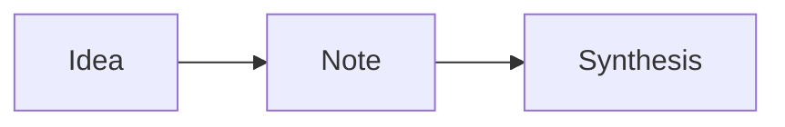

# Notes schema

Authoritative reference for note structure. AI agents read this to know what fields exist, what values are valid, and what conventions are in play. Edit this file to adapt the template to your project — these are defaults, not laws.

## Frontmatter

Every note in `notes/` (excluding files in `_examples/`) must have YAML frontmatter with these fields:

| Field | Required | Type | Notes |
|---|---|---|---|
| `title` | yes | string | Human-readable title |
| `status` | yes | enum | `draft` \| `active` \| `synthesised` \| `archived` |
| `date` | yes | date | ISO format (YYYY-MM-DD), date the note was first written |
| `tags` | yes | array | Free-form, kebab-case (e.g. `[research, ui-patterns]`) |
| `summary` | yes | string | One- or two-sentence summary. The cheapest way to skim a note. |
| `key_claims` | optional | array | Stable claim references made in this note (e.g. `[claim:auth-001]`) |
| `open_questions` | optional | array | Questions raised but not resolved |
| `related` | optional | array | Filenames of related notes |
| `source` | optional | string | URL, person, doc, or meeting that prompted the note |
| `type` | optional | enum | `note` (default) \| `decision` (see Decision notes below) |

## Section conventions

Default body sections (in order). Stable section names are what make cross-note queries cheap — agents can grep `## Synthesis` to find synthesis content across the whole notes folder without reading bodies.

- `## Context` — Why this note exists. What prompted it.
- `## Observations` — Raw notes, claims, evidence. Keep separable from interpretation.
- `## Synthesis` — Patterns, tensions, implications. Your current thinking.
- `## Open questions` — Unresolved threads. Phrase as questions.
- `## Next` — Concrete next actions or notes to write.

You may add additional sections, but do not rename or omit these without updating this schema.

## Inline tag conventions

Short greppable markers placed inline in the body. Agents grep for these to surface specific content types across notes without reading full bodies.

- `[#decision]` — A decision was made at this point. Often paired with rationale.
- `[#claim]` — A factual claim or finding. Should be cite-able.
- `[#question]` — An open question raised inline.
- `[#blocker]` — Something blocking progress.
- `[#todo]` — A small action item embedded in prose.

Place the tag at the start of the relevant sentence or paragraph: `[#decision] We will use Mermaid for diagrams because…`

## Claim IDs

When a claim or finding will be referenced from other notes, give it a stable ID:

```
[claim:auth-001] Users prefer passwordless flows in B2C contexts.
```

Format: `[claim:<topic>-<NNN>]`. Topic is short kebab-case. NNN is a zero-padded number. Once assigned, never renumber — other notes will reference the ID. Add the ID to the note's `key_claims:` frontmatter so it surfaces in INDEX.md.

## Decision notes

Notes with `type: decision` follow a stricter body structure (analogous to ADRs in software). Use these when you want to capture *why* something was decided so future you (or an agent) can understand context later.

- `## Context` — What problem prompted the decision.
- `## Options considered` — At least 2.
- `## Decision` — What was chosen.
- `## Consequences` — What this implies, including downsides.

## Diagrams

Two supported workflows — pick based on whether you or an agent is producing the diagram. Full conventions in `../CONVENTIONS.md`.

### draw.io (primary, for human-drawn)

Save source as `notes/diagrams/<name>.drawio`. Export as `notes/diagrams/<name>.svg`. Embed in the note:

```markdown

```

Edit the `.drawio` source in the draw.io app; re-export the `.svg` after changes.

### Mermaid (secondary, for AI-generated inline)

Embedded inline in markdown:

````

````

Renders natively in GitHub, Obsidian, VSCode preview. Use when asking Claude to diagram something, or when a quick flowchart works without a separate image file.

## Glossary

Definitions of project-specific terms used in agent instructions and processes. If you find yourself using a word with a specific meaning in this template, add it here.

- **synthesis** — The act of extracting patterns, tensions, and implications from a set of observations or notes. Distinct from summarisation: synthesis produces *new claims*, summarisation just compresses.
- **claim** — A factual statement supported by evidence. Should be cite-able by ID once given one.
- **draft** — A note that's still being written. Agents should not synthesise from drafts unless explicitly told.
- **active** — A note in current use. Default state for finished notes.
- **synthesised** — A note whose insights have been extracted into derived work (another note, document, prototype). Still readable but lower priority for new synthesis runs.
- **archived** — A note that's no longer relevant. Excluded from default agent context via `.agentignore`.

## Customising

This schema is meant to be adapted. When you change conventions, update this file and `notes/AGENTS.md` so agents stay in sync. Run `check.sh` (at the repo root) to detect notes whose frontmatter no longer matches the schema.
