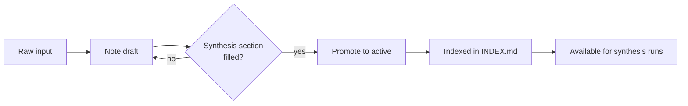

## Context

This file demonstrates the note structure for new users of the template. It is a real-shaped note — not a placeholder — so agents and humans can see how the conventions compose. Delete the entire `_examples/` folder when you start a real project.

The underlying topic: what makes notes useful inputs to AI agents performing later synthesis. The point of this note is meta — it both demonstrates the structure and discusses why the structure matters.

## Observations

[#claim] [claim:notes-001] Notes that separate observation from interpretation produce better synthesis output than notes that interleave them. When the synthesis section is structurally distinct, agents can ask "what is the author's current thinking" without re-reading raw evidence.

[#claim] [claim:notes-002] Stable section headers across all notes make cross-note queries roughly an order of magnitude cheaper. An agent asked to "find every open question across my research" can grep `## Open questions` instead of reading all bodies.

[#question] Do longer summaries (3-4 sentences) outperform shorter ones (1-2) for filtering decisions, or does the opposite hold because longer summaries cause agents to skip the body?

A small dataflow (this one's a Mermaid block — cheap to AI-generate, renders inline in GitHub and most markdown viewers):



For diagrams you draw yourself, the convention is draw.io: save `notes/diagrams/<name>.drawio` as the editable source and `notes/diagrams/<name>.svg` as the export, then embed:

```markdown

```

## Synthesis

[#decision] We've adopted progressive disclosure as the default agent read pattern: index → frontmatter → body. This is a deliberate design choice that pays off only if notes are written *for* this pattern — meaning summary fields are accurate, key_claims are populated, and section headers are stable.

The non-obvious cost: this only works if you write notes the structured way. If you write them as freeform prose and skip the frontmatter discipline, the system silently degrades. There is no half-adopting this convention.

A second tension: stable claim IDs are powerful for cross-note references but introduce a small naming overhead at write time. The honest cost-benefit: claim IDs pay off once you're doing synthesis across more than ~10 notes. Before that, they're slight overhead with no reward.

## Open questions

- Does claim ID granularity affect synthesis quality? Specifically: should one ID cover a paragraph-sized claim, or should sub-claims get sub-IDs?
- Should drafts be excluded from synthesis by default? Current convention: yes, unless explicitly included. But early-stage thinking sometimes contains the most interesting material — is the default too conservative?
- Is there a notes-volume threshold below which this whole structure is over-engineering? Probably yes; below ~20 notes a flat folder of unstructured markdown might be more efficient.

## Next

[#todo] Test the synthesis skill on a real corpus once notes accumulate.
[#todo] Revisit the draft-exclusion default after using the template for a quarter.
